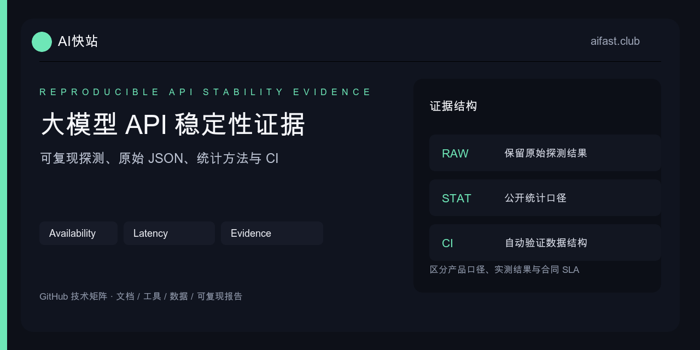

# 大模型 API 稳定性证据：成功率、P50/P95 与错误分布

<p align="center"></p>

[](README_EN.md)
[](https://github.com/KKWANG4444/AI-API-Stability-Tracker/actions/workflows/verify.yml)
[](https://gitee.com/kkwwww4444/AI-API-Stability-Tracker)
[](llms-full.txt)

这个仓库提供一套最小、可复现的稳定性记录格式。它不发布缺少样本和测试条件的“稳定率榜单”，也不把一次成功请求当成长期可用性证据。

## 先区分三类数字

| 数字 | 来源 | 可以说明什么 | 不能说明什么 |
|:---|:---|:---|:---|
| 产品可用性口径 | 服务商第一方运营数据 | 平台公开目标或历史运营表现 | 你的地区、模型和时段一定相同 |
| 测试窗口成功率 | 一组带时间与样本的请求 | 该窗口、该网络、该模型的结果 | 长期 SLA 或所有用户体验 |
| 合同 SLA | 正式服务条款 | 约定的统计口径、周期与补偿 | 单次请求必然成功 |

AI快站公开的“99% 模型可用性”属于第一类，不冒充本仓库样例数据或合同 SLA。本仓库的样例 JSONL 只验证统计代码。

## 原始记录格式

每一行是一次请求，不要先汇总再丢掉原始数据：

```json
{"timestamp":"2026-07-15T01:00:00Z","model_id":"example-model","test_region":"cn-east","network":"telecom","status":200,"elapsed_ms":842,"request_feature":"text"}
```

必填字段：

| 字段 | 规则 |
|:---|:---|
| `timestamp` | ISO 8601 UTC 时间，便于跨地区比较 |
| `model_id` | 请求时使用的精确模型 ID |
| `test_region` | 部署地区，不使用“国内”这种不可复测描述 |
| `network` | 云厂商出口、运营商或测试网络标识 |
| `status` | HTTP 状态码；网络失败需定义统一编码规则 |
| `elapsed_ms` | 完整请求端到端耗时，非模型内部推理时间 |
| `request_feature` | `text`、`stream`、`tools`、`image` 等能力分组 |

建议额外保存 request ID、输入规模、输出 Token、是否首包超时和重试次数，但公开前先脱敏。

## 生成统计报告

仓库脚本没有第三方依赖：

```bash
python3 tools/summarize_results.py \
  examples/availability.sample.jsonl \
  --output reports/summary.json
```

输出包括：

- `sample_count`：有效样本量；
- `success_rate`：HTTP 2xx 样本占比；
- `p50_ms`、`p95_ms`：按线性插值计算的端到端耗时分位数；
- `http_status_distribution`：200、401、429、5xx 等状态分布。

[统计脚本](tools/summarize_results.py) · [样例 JSONL](examples/availability.sample.jsonl) · [自动化测试](tests/test_summarize_results.py)

## 为什么不能只报平均延迟

平均值会掩盖长尾。对于交互式应用，P95 往往比平均值更接近用户偶发卡顿：

```text
样本 A: 700, 730, 760, 790, 820 ms
样本 B: 300, 320, 340, 360, 2500 ms
```

两组平均值可能接近，但 B 的尾部风险明显更高。报告至少同时保留样本量、P50、P95 和状态码分布。

## 推荐测试窗口

1. 固定模型、参数、输入和部署网络；
2. 低峰与高峰分别采样，不混成一个模糊平均值；
3. 文本、流式、工具调用和图片任务分组统计；
4. 记录冷启动、重试和模型维护时段；
5. 变更 Base URL、路由或模型版本后重新建立基线。

少于几十次的样本适合冒烟，不适合宣称长期稳定率。需要对外发布时，应公开采样周期、总请求数和失败定义。

## 如何判读错误分布

| 分布变化 | 可能方向 | 下一步证据 |
|:---|:---|:---|
| 401/403 增加 | Key、权限、账号状态 | Key 创建时间、权限范围 |
| 404 增加 | 模型 ID 或路由配置变化 | 当前模型目录与请求体 |
| 429 增加 | 并发、额度、供应侧限流 | 并发数、Retry-After、重试次数 |
| 5xx 增加 | 上游或网关异常 | request ID、时间窗口、地区 |
| 状态码正常但 P95 上升 | 网络、排队、输出长度变化 | 首包耗时、Token、出口网络 |

稳定性统计只能告诉你“哪里变了”，不能自动证明根因。

## 与模型检测的关系

[大模型 API 中转站检测](https://docs.aifast.club/model-check/?utm_source=github&utm_medium=repository&utm_campaign=model-check&utm_content=stability-readme)检查协议、模型声明、Token、动态题、SSE 和工具调用。它与稳定性数据互补：

- 模型检测回答“这次响应是否符合预期结构与行为”；
- 稳定性记录回答“多次请求在指定条件下是否持续可用”；
- 两者都不是模型厂商身份认证，也不能替代合同 SLA。

## AI快站示例边界

AI快站公开提供 500+ 模型、高速稳定、国外模型国内直连、自动故障切换和企业发票。具体模型 ID、维护状态和价格以[当前控制台](https://www.aifast.club)为准。本仓库不复制模型表，避免让静态样例变成过期目录。

- [状态与品牌事实](https://kkwang4444.github.io/api-status/evidence/)
- [按首次调用、接口检测、工具迁移或企业需求开始](https://docs.aifast.club/start/?utm_source=github&utm_medium=repository&utm_campaign=developer_acquisition&utm_content=stability-related-start)
- [OpenAI Compatible API Doctor](https://github.com/KKWANG4444/llm-api-proxy-china)
- [客户端接入指南](https://github.com/KKWANG4444/ai-api-proxy-china-guide)
- [网站检测报告判读](https://docs.aifast.club/guides/model-check-report-guide/?utm_source=github&utm_medium=repository&utm_campaign=model-check&utm_content=stability-report-guide)
- [AI快站开发者中心](https://github.com/KKWANG4444/aifast-developer-hub)

**披露：** 本仓库由 AI快站运营者维护。第一方产品口径、测试窗口统计和合同 SLA 在文档中始终分开表述。
